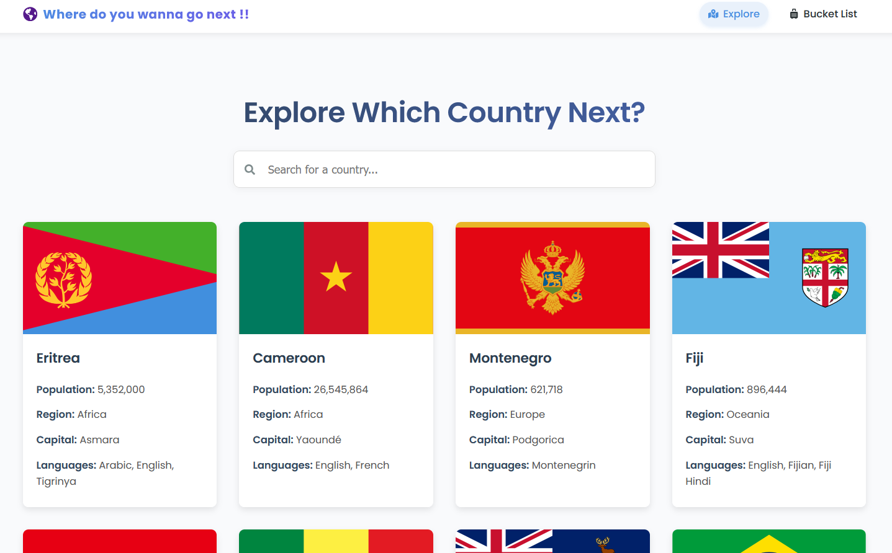

my first ever react project

data is fetched directly from https://restcountries.com/v3.1/all


##  Project Structure

```bash
country-info/
├── src/
│   ├── App.jsx             
│   ├── components/
│   │   ├── Navbar.jsx      
│   │   └── CountryCard.jsx 
│   ├── pages/
│   │   ├── HomePage.jsx    
│   │   └── BucketListPage.jsx 
│   └── main.jsx            
├── public/
│   └── index.html          
└── package.json            

```

